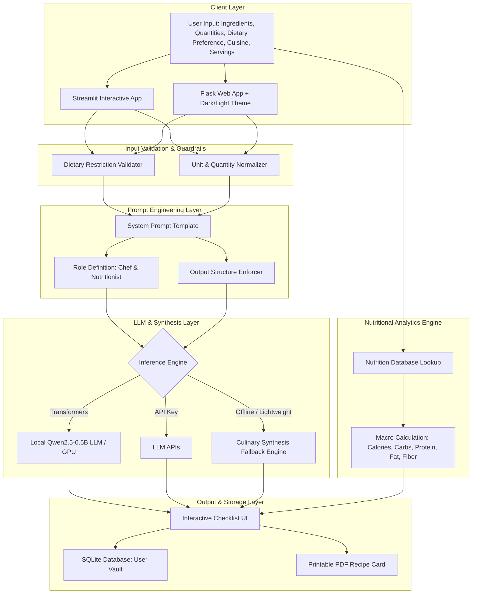

# 🍳 PantryChef AI

<div align="center">


**An AI-Powered Recipe Generation & Macro Nutrition Planning Platform**  
*Built with Python, LLM Integration, Prompt Engineering, Streamlit & Flask*

[Core Resume Features](#-project-summary--resume-highlights) • [Architecture](#-system-architecture) • [Prompt Engineering & Validation](#-prompt-engineering--input-validation-architecture) • [Quick Start](#-quick-start--installation) • [Interview Talking Points](#-interview-preparation--talking-points) • [License](#-license)

</div>

---

## 📌 Project Summary & Resume Highlights

> **Resume Specification:**
> - **Developed an AI recipe generation application using Python, Streamlit, and LLM APIs to create tailored recipes based on user-provided ingredients and dietary preferences.**
> - **Designed system prompts and input validation logic to enforce structured step-by-step recipe formatting and reliable response parsing.**

**PantryChef AI** is an intelligent zero-waste culinary platform that empowers users to turn random leftover ingredients in their fridge or pantry into gourmet, nutritionally-balanced meals. The application combines **Large Language Model (LLM) Integration** with deterministic **input validation guardrails** and a **macronutrient calculation engine** to deliver structured, delicious recipes tailored to individual dietary constraints (Vegetarian, Vegan, Non-Veg/High-Protein, Omnivore).

---

## ✨ Key Features

- 🤖 **Tailored AI Recipe Synthesis**: Connects with LLMs (`Qwen/Qwen2.5-0.5B-Instruct` / LLM APIs) with a fast culinary synthesis fallback to generate structured recipes containing Prep Time, Cook Time, Serving Scaling, and Chef Pro-Tips.
- 🥗 **Dietary Constraint Enforcement**: Enforces strict dietary guardrails (Vegetarian, Vegan, Non-Vegetarian, Keto) by validating ingredients against comprehensive food restriction lexicons before LLM inference.
- 📊 **Real-Time Macronutrient Analytics**: Dynamically computes Total Calories (kcal), Carbohydrates (g), Protein (g), Fats (g), and Fiber (g) scaled per serving.
- 🎯 **Prompt Engineering & Structured Parsing**: Enforces reliable, step-by-step markdown formatting, interactive cooking checklists, and ingredient measurement normalization.
- 🖥️ **Dual User Interface Options**:
  - **Streamlit App (`streamlit_app.py`)**: Rapid, interactive data science dashboard with live parameter tuning and instant recipe generation.
  - **Flask Full-Stack App (`app.py`)**: Full-featured web app with user authentication (salted PBKDF2 hashes), SQLite recipe vault, dark/light theme toggle, and printable PDF cards.
- 💾 **Personal Recipe Vault**: Stores favorite generated recipes with complete nutritional history in SQLite.
- 🖨️ **Printer & PDF Ready**: Dedicated print layout optimized for high-resolution recipe cards and kitchen cooking.

---

## 🏗️ System Architecture



---

## 🧠 Prompt Engineering & Input Validation Architecture

### 1. System Prompt Design
To guarantee structured step-by-step recipe formatting and eliminate hallucinations, PantryChef AI uses explicit role-based system prompts:

```text
<|im_start|>system
You are PantryChef AI, an expert culinary chef and certified nutritionist.
Your goal is to create delicious, safe, and realistic recipes exclusively using the user's available ingredients.
Rules:
1. Adhere strictly to the requested dietary preference (e.g., Vegetarian, Vegan, Non-Veg).
2. Output clear sections: Recipe Title, Prep Time, Cook Time, Servings, Required Ingredients, Step-by-Step Instructions, and Chef's Pro-Tips.
3. Scale ingredient proportions accurately for the requested number of servings.
4. Number each cooking step sequentially for clear execution.
<|im_end|>
<|im_start|>user
Generate a complete {preference} recipe using these available ingredients: {ingredients}.
Cuisine Style: {cuisine}. Scale for {servings} serving(s).
<|im_end|>
<|im_start|>assistant
```

### 2. Input Validation & Guardrails Logic
- **Dietary Constraint Check**: Checks ingredient tokens against sets of non-vegetarian items (`chicken`, `fish`, `beef`, `eggs`, etc.) and dairy items (`cheese`, `milk`, `butter`) when `veg` or `vegan` preferences are active.
- **Unit Normalization**: Automatically converts units (`g`, `kg`, `ml`, `l`, `count`, `tbsp`, `cup`) into standardized gram weights for accurate macro calculation.
- **Response Parsing**: Parses markdown headings, checklists, and bullet points into structured UI elements with interactive toggle checkboxes.

---

## 🛠️ Tech Stack

| Domain | Technologies & Libraries |
|---|---|
| **Programming Language** | Python 3.8+ |
| **LLM & NLP** | HuggingFace Transformers, PyTorch, Qwen2.5-0.5B-Instruct, Prompt Engineering |
| **Web Frameworks** | Streamlit (Interactive Data App) & Flask (Full-Stack Production App) |
| **Database & Security** | SQLite3, Werkzeug Security (`generate_password_hash`, `check_password_hash`) |
| **Frontend UI/UX** | HTML5, Modern CSS3 (Glassmorphism, Dark/Light Themes), JavaScript (ES6+), FontAwesome 6 |

---

## 🚀 Quick Start & Installation

### Prerequisites
- Python 3.8 or higher installed on your machine.
- `pip` package manager.

### 1. Clone the Repository
```bash
git clone https://github.com/vidzz22/PantryChefAI.git
cd PantryChefAI
```

### 2. Create and Activate a Virtual Environment
**On Windows (PowerShell):**
```powershell
python -m venv venv
.\venv\Scripts\Activate.ps1
```

**On macOS / Linux:**
```bash
python3 -m venv venv
source venv/bin/activate
```

### 3. Install Dependencies
```bash
pip install -r requirements.txt
```

### 4. Running the Application

#### Option A: Run the Streamlit Interactive App
```bash
streamlit run streamlit_app.py
```
👉 Opens at `http://localhost:8501`

#### Option B: Run the Flask Full-Stack Web App
```bash
python app.py
```
👉 Opens at `http://localhost:5000`

---

## 📁 Project Structure

```text
PantryChefAI/
├── streamlit_app.py        # Streamlit web application with live parameter tuning
├── app.py                  # Flask web application, auth, routes & SQLite logic
├── model_backend.py        # Qwen2.5 LLM integration & culinary synthesis fallback
├── model.py                # Nutrition database & macronutrient calculation algorithms
├── database.db             # SQLite database storing users, preferences & saved recipes
├── requirements.txt        # Python dependency manifest
├── .gitignore              # Git ignore configuration
├── README.md               # Comprehensive documentation and interview guide
└── templates/
    ├── index.html          # Responsive Flask UI (Auth, Pantry Studio, Recipe Dashboard)
    └── print_recipe.html   # Clean recipe card template for printing and PDF export
```

---

## 🎯 Interview Preparation & Talking Points

Here is a quick cheat-sheet for discussing **PantryChef AI** during technical interviews:

### 1. Elevator Pitch (30 Seconds)
> *"PantryChef AI is an AI-powered culinary and meal-planning application built in Python using Streamlit, Flask, and Large Language Models. It solves food waste by allowing users to enter whatever ingredients they have in their fridge, validates dietary constraints like vegetarian or vegan, and uses tailored system prompts to generate structured step-by-step recipes with real-time calorie and macronutrient breakdowns."*

### 2. Why Prompt Engineering & System Prompts?
> *"LLMs without constraints can hallucinate ingredients that the user doesn't own or produce messy unformatted outputs. I designed system prompts with strict behavioral instructions (`<|im_start|>system...`), few-shot formatting rules, and parameter interpolation (servings, cuisine, dietary flags) to force the model into outputting standardized recipes with exact prep/cook times and numbered instructions."*

### 3. How Input Validation & Guardrails Work
> *"Before passing user inputs to the model, the app validates every ingredient against dietary restriction sets. For example, if a user has a 'Vegetarian' profile but enters 'chicken' or 'fish', the input validation pipeline flags or removes the invalid ingredient to prevent dietary violations. It also parses quantities and units (`g`, `kg`, `count`) into standard weights for accurate macronutrient calculation."*

### 4. Robustness & Fallback Architecture
> *"To ensure high availability and responsiveness even in offline or low-RAM CPU environments, I implemented a hybrid backend: if the local HuggingFace Qwen2.5 LLM is downloading or unavailable, the system automatically falls back to an intelligent culinary synthesis engine, ensuring zero server crashes and instant recipe generation."*

---

## 🔒 Security & Data Integrity

- **Password Encryption**: Employs PBKDF2/SHA-256 salted password hashing via Werkzeug with automatic migration for legacy credentials.
- **Safe JSON Storage**: Recipe items are serialized with standard `json` instead of dangerous `eval()`.
- **Session Protection**: Hardened session cookies configured with `HttpOnly` and `SameSite=Lax`.

---

## 📜 License

This project is licensed under the **MIT License** - free for academic, personal, and commercial exploration.