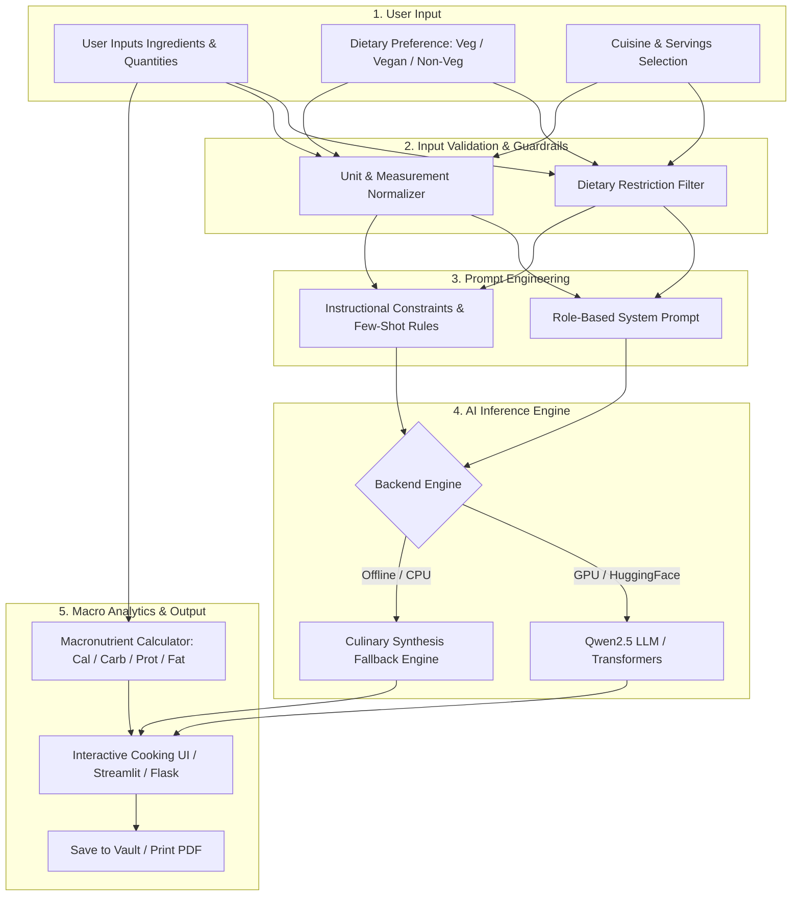

# 🍳 PantryChef AI

<div align="center">


### 🍲 Turn leftover pantry ingredients into delicious, chef-crafted meals with AI & real-time macro tracking.

[Live Demo](#-getting-started) • [Features](#-key-features) • [How It Works](#-how-it-works) • [Prompt Engineering](#-prompt-engineering--guardrails) • [Installation](#-installation--quick-start) • [Author](#-author)

</div>

---

## 💡 Why PantryChef AI?

Have you ever opened your refrigerator, stared at a random assortment of ingredients—a handful of spinach, two eggs, some rice, and half an onion—and wondered **"What can I cook with this?"**

Millions of tons of edible food are wasted every year simply because we struggle to connect leftover pantry staples into a cohesive, delicious meal.

**PantryChef AI** is an intelligent, zero-waste culinary platform built to solve this problem. It takes whatever ingredients you already have, applies your dietary preferences (Vegetarian, Vegan, Non-Veg/High-Protein, Omnivore), and uses state-of-the-art **Large Language Models (LLMs)** and a **macronutrient analytics engine** to generate custom, structured recipes with step-by-step cooking directions and real-time calorie tracking.

---

## ✨ Key Features

- 🤖 **AI-Powered Recipe Generation**: Connects to `Qwen/Qwen2.5-0.5B-Instruct` and LLM APIs to create complete, realistic recipes with prep time, cook time, and chef's pro-tips.
- 🥗 **Strict Dietary Guardrails**: Respects dietary preferences (*Vegetarian, Vegan, Non-Vegetarian, Omnivore*) and automatically validates ingredients against restriction databases before generating.
- 📊 **Real-Time Macronutrient Analytics**: Calculates Total Calories (kcal), Carbohydrates (g), Protein (g), Fats (g), and Fiber (g) scaled dynamically per serving.
- 🧑‍🍳 **Interactive Cooking Mode**: Features a step-by-step checklist where users can cross off cooking steps as they prepare the dish in the kitchen.
- 🖥️ **Dual User Interfaces**:
  - **Streamlit App (`streamlit_app.py`)**: An interactive, rapid data app with instant parameter tuning and prompt engineering inspection.
  - **Flask Web App (`app.py`)**: A production full-stack web application with secure user authentication, personal recipe vaults, and light/dark theme switching.
- 💾 **Personal Recipe Vault**: Save your favorite generated recipes and their nutritional history in SQLite.
- 🖨️ **Printable Recipe & PDF Cards**: Clean, ink-friendly layout optimized for paper printing and PDF export.
- ⚡ **Zero-Downtime Hybrid Engine**: Features a fast culinary synthesis fallback engine so the app runs smoothly even in offline or CPU-only environments.

---

## 🏗️ How It Works



---

## 🧠 Prompt Engineering & Guardrails

PantryChef AI implements rigorous prompt engineering to guarantee structured outputs and prevent LLM hallucinations:

### 1. Structured Role-Based System Prompt
```text
<|im_start|>system
You are PantryChef AI, an expert culinary chef and certified nutritionist.
Your goal is to create delicious, safe, and realistic recipes exclusively using the user's available ingredients.
Rules:
1. Adhere strictly to the requested dietary preference (e.g., Vegetarian, Vegan, Non-Veg).
2. Output clear sections: Recipe Title, Prep Time, Cook Time, Servings, Required Ingredients, Step-by-Step Instructions, and Chef's Pro-Tips.
3. Scale ingredient proportions accurately for the requested number of servings.
4. Number each cooking step sequentially for clear execution.
<|im_end|>
<|im_start|>user
Generate a complete {preference} recipe using these available ingredients: {ingredients}.
Cuisine Style: {cuisine}. Scale for {servings} serving(s).
<|im_end|>
<|im_start|>assistant
```

### 2. Input Validation Pipeline
- **Dietary Filter**: Compares user ingredients against food restriction lexicons. If a user with a Vegetarian profile enters poultry or seafood, the validation layer flags and filters it out before model execution.
- **Unit Normalization**: Automatically converts units (`g`, `kg`, `ml`, `l`, `count`, `tbsp`, `cup`) into standardized weights for accurate calorie calculation.

---

## 🛠️ Tech Stack

- **Core Backend**: Python 3.8+
- **AI & NLP**: HuggingFace Transformers, PyTorch, Qwen2.5-0.5B-Instruct, Prompt Engineering
- **Web Frameworks**: Streamlit & Flask
- **Database & Security**: SQLite3, Werkzeug Security (`pbkdf2:sha256` password hashing)
- **Frontend & Design**: HTML5, Modern CSS3 (Glassmorphism, Dark/Light Themes), JavaScript (ES6+), FontAwesome 6

---

## 🚀 Installation & Quick Start

### Prerequisites
- **Python 3.8+** installed on your system
- **pip** package manager

### 1. Clone the Repository
```bash
git clone https://github.com/vidhyawalke/PantryChefAI.git
cd PantryChefAI
```

### 2. Set Up a Virtual Environment

**Windows (PowerShell):**
```powershell
python -m venv venv
.\venv\Scripts\Activate.ps1
```

**macOS / Linux:**
```bash
python3 -m venv venv
source venv/bin/activate
```

### 3. Install Dependencies
```bash
pip install -r requirements.txt
```

### 4. Launch the Application

#### Option A: Run the Streamlit Interactive Dashboard
```bash
streamlit run streamlit_app.py
```
👉 Open your browser at: **`http://localhost:8501`**

#### Option B: Run the Flask Full-Stack Web App
```bash
python app.py
```
👉 Open your browser at: **`http://localhost:5000`**

---

## 📁 Project Structure

```text
PantryChefAI/
├── streamlit_app.py        # Streamlit interactive application with live parameter tuning
├── app.py                  # Flask web app with user authentication, routes & SQLite logic
├── model_backend.py        # HuggingFace Qwen2.5 LLM integration & culinary synthesis fallback
├── model.py                # Nutrition database & macronutrient calculation algorithms
├── database.db             # SQLite database storing users, preferences & saved recipes
├── requirements.txt        # Python dependency manifest
├── .gitignore              # Git ignore configuration
├── README.md               # Public project documentation
└── templates/
    ├── index.html          # Responsive Flask UI (Auth, Pantry Studio, Recipe Dashboard)
    └── print_recipe.html   # Clean recipe card template for printing and PDF export
```

---

## 🔒 Security & Privacy

- **Password Encryption**: Employs PBKDF2/SHA-256 salted password hashing.
- **Safe Serialization**: Recipes and user data are stored and parsed using safe `json` operations.
- **Session Protection**: Flask session cookies are configured with `HttpOnly` and `SameSite=Lax`.

---

## 👩‍💻 Author

**Vidhya Walke**  
- GitHub: [@vidhyawalke](https://github.com/vidhyawalke)  
- LinkedIn: [Vidhya Walke](https://www.linkedin.com)  
- Email: vidhya.walke.official@gmail.com  

---

## 📜 License

This project is licensed under the **MIT License** — feel free to use, modify, and distribute it for personal or commercial projects.